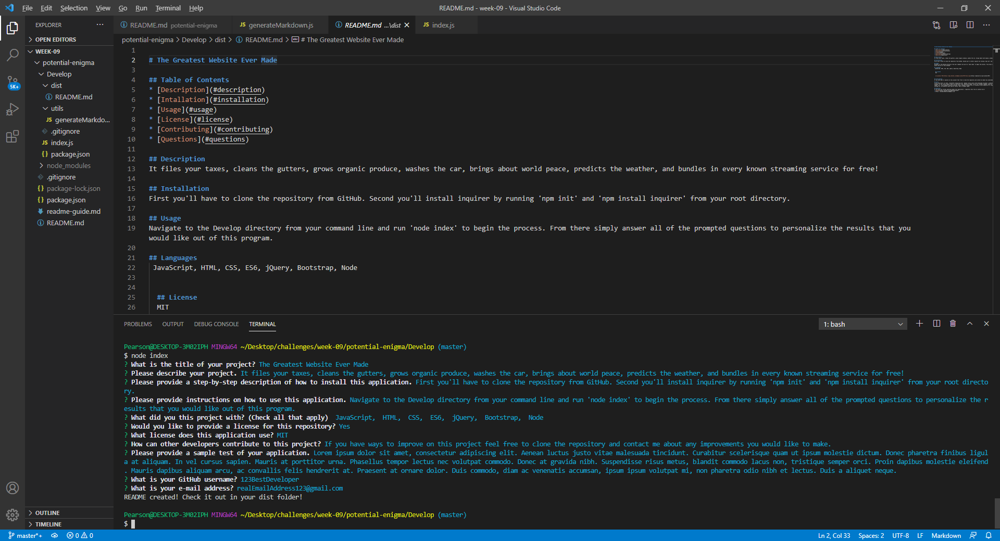
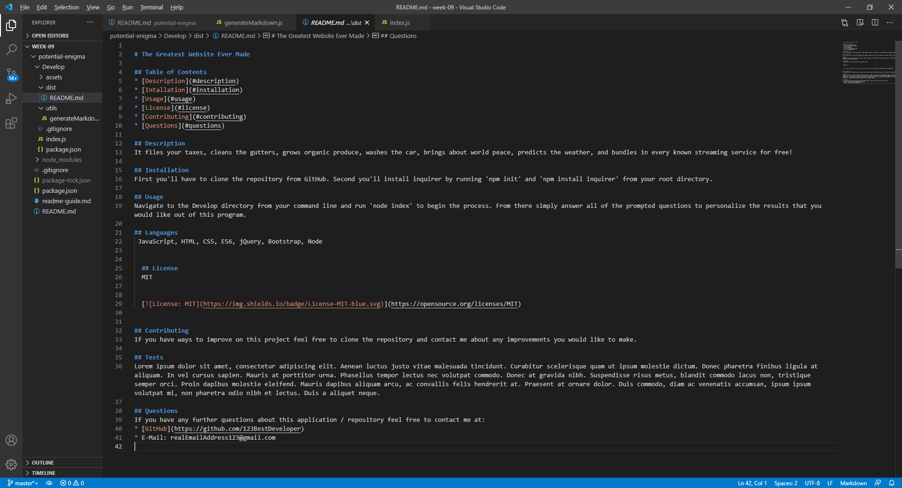
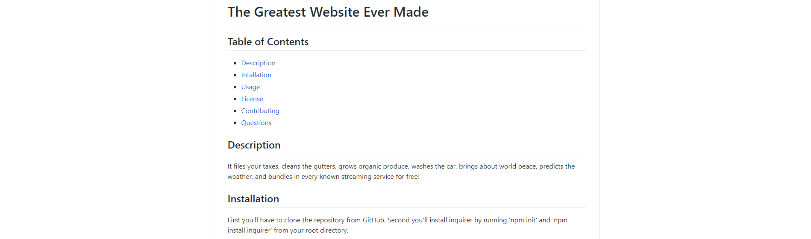
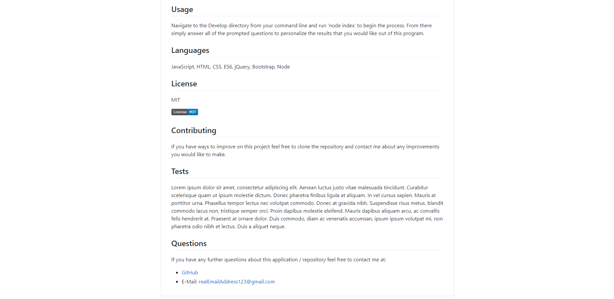

# ReadMe Generator

## Table of Contents
* [Description](#description)
* [Intallation](#installation)
* [Usage](#usage)
* [Screenshots](#screenshots)
* [Questions](#questions)

## Description
Provides a professional README.md document based on the user's response to questions.

## Installation
First, clone the repository from GitHub. Second, run 'npm init' from the root of your project's command line. Lastly, from the same root directory run 'npm install inquirer' from the command line.

## Usage
From the command line navigate to the 'Develop' directory and run 'node index' to begin the program. From there simply answer all the questions provided. Afterwards you will fine your personalized README.md file in the 'dist' directory within 'Develop.'

## Tutorial
Watch: https://drive.google.com/file/d/1q0WFByaZBeVXXffL0bRs5mO6q7qT-Df1/view

## Languages
 JavaScript, ES6, Node, Inquirer

## Screenshots

## Questions
If you have any further questions about this application / repository feel free to contact me at: 
* [GitHub](https://github.com/jpkashlak)
* E-Mail: jpkashlak@gmail.com
